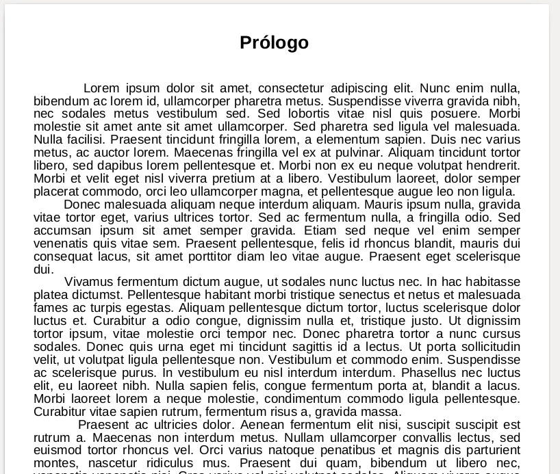
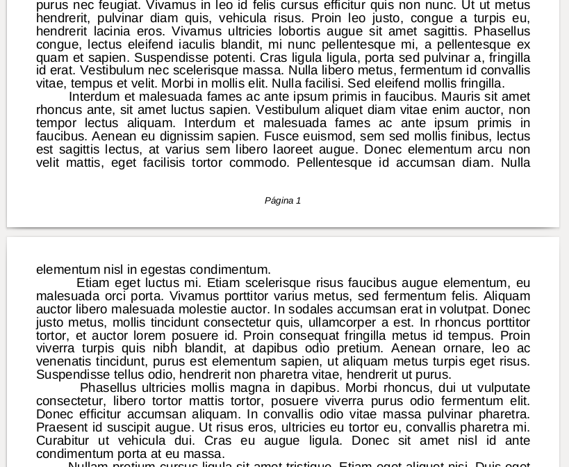
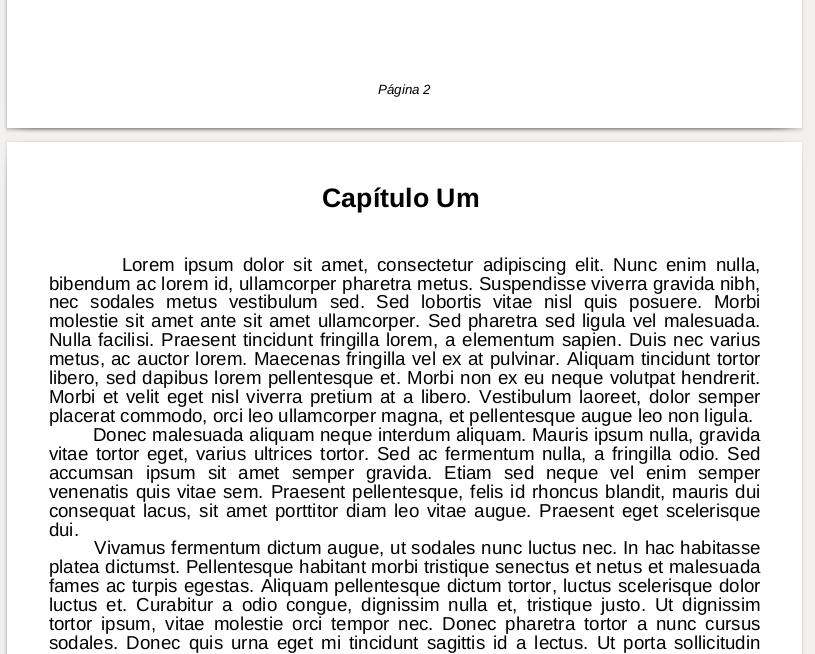

# text-file-to-pdf-python
Converte arquivos .txt em um arquivo PDF utilizando Python e a biblioteca FPDF.

### Arquivos texto presentes na aplicaço
Estes são os arquivos .txt contendo parágrafos gerados utilizando o Lorem Ipsum

> text-file-to-pdf/screenshots/print_files.png

E algumas screenshots do PDF gerado

> text-file-to-pdf/screenshots/print_pdf1.png

> text-file-to-pdf/screenshots/print_pdf2.png

> text-file-to-pdf/screenshots/print_pdf3.png

